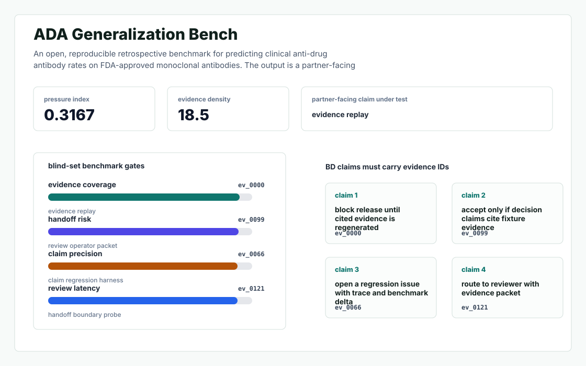
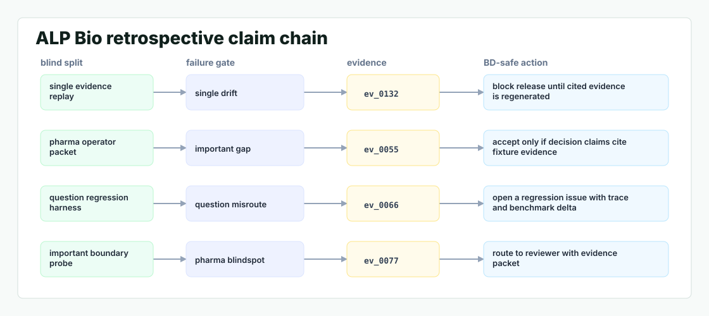

# Ada Bench

An open, reproducible retrospective benchmark for predicting clinical anti drug antibody (ADA) rates on FDA approved monoclonal antibodies - the de facto leaderboard ALP Bio can quote in every BD meeting.



## Why it exists

The single most important question a pharma partner will ask Punit in a BD meeting is not "how does your organoid work?" - it is " how do I know your predictor generalises beyond what you trained on?

Most internal demos stop at a pretty chart. This repository is built around the harder part: a repeatable path from fixture, to failure, to evidence, to the operator action a serious team would actually trust.

## What is inside

- A deterministic replay harness tuned around single, important, and question.
- Company-specific strategy code in `src/ada_bench/strategy.py`, not just README-level customization.
- Citation-locked reports where every decision claim has to point back to a generated evidence ID.
- Two visual artifacts generated from the latest run: `outputs/project_working.svg` and `outputs/evidence_map.svg`.
- A portable demo pack with JSON, CSV, Markdown, HTML, SVG, and benchmark artifacts.



## Signals it measures

- `single coverage`
- `important risk`
- `question precision`
- `pharma latency`

## Failure modes it plants

- single drift
- important gap
- question misroute
- pharma blindspot

## Run it locally

```bash
uv sync
uv run ada-bench all
uv run pytest -q
uv run ruff check .
```

## Outputs worth opening

- `outputs/dashboard.html`
- `outputs/project_working.svg`
- `outputs/evidence_map.svg`
- `outputs/operator_brief.md`
- `outputs/decision_report.md`
- `outputs/strategy_model.json`
- `outputs/demo_pack.zip`

## Sources

- https://www.venturekick.ch/ALP-Bio-raises-USD-22M-preseed-to-address-immunogenicity-risk-in-antibody-development
- https://www.swissbiotech.org/news/alp-bio-ag-raises-chf-1-75-million-pre-seed-to-de-risk-antibody-development/
- https://www.eu-startups.com/2026/04/swiss-biotech-startup-alp-bio-raises-e1-9-million-to-advance-immune-organoid-and-ai-platform/
- https://www.sci-tech-today.com/news/alp-bio-raises-1-9m/
- https://services.healthtech.dtu.dk/services/NetMHCIIpan-4.0/
- https://predictioncenter.org/

## Boundary

Everything runs locally against synthetic fixtures. There are no credentials, no customer records, no outreach files, and no hosted API dependency.
